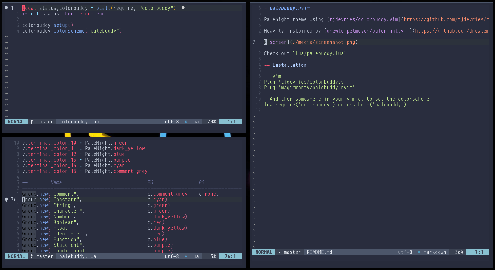

# palebuddy.nvim

Palenight theme using [tjdevries/colorbuddy.vim](https://github.com/tjdevries/colorbuddy.vim)

Heavily instpired by [drewtempelmeyer/palenight.vim](https://github.com/drewtempelmeyer/palenight.vim)



Check out `lua/palebuddy.lua`

## Installation

```vim
Plug 'tjdevries/colorbuddy.vim'
Plug 'magicmonty/palebuddy.nvim'

" And then somewhere in your vimrc, to set the colorscheme
lua require('colorbuddy').colorscheme('palebuddy')
```
